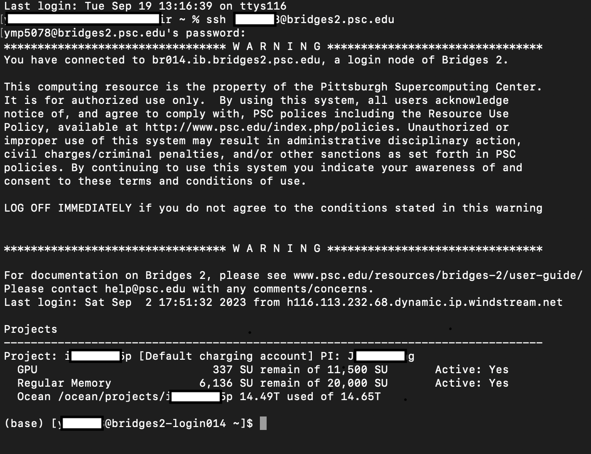
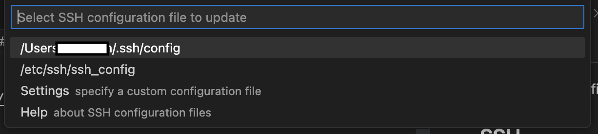
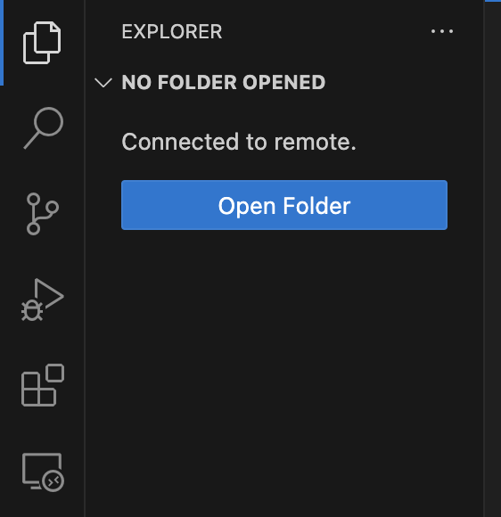

# 0 to $\epsilon$ Toturial on the Computer Servers

**Table of content:**
 - [Connect](#connect)
 - [Running a Job](#running-a-job)

 ## Connect
 Refer to the specific user guide for the server (e.g., [Bridges-2 User Guide](https://www.psc.edu/resources/bridges-2/user-guide/), [Delta User Guide](https://wiki.ncsa.illinois.edu/display/DSC/Delta+User+Guide))

 ### SSH
 1. Type in in your command line `ssh <user-name>@bridges2.psc.edu` to connect to the default port 22.

 2. Type in your passward.

 3. Once you are loged in, you will see the following page:
 

 ### VSCode

Connecting thru SSH will work but if you want to navigate the file system more easily and modify the code without using terminal editor, you should setup your vscode following the steps below.

 1. Download [VSCode](https://code.visualstudio.com/) if you have not already.

 2. Once you open the VSCode, click the Extensions button  on the left of the screen.

 3. Search for "Remote Explorer" and click install.

 4. Once you installed the Remote Explorer, you will see the button  on the left of the screen.

 5. Click it and you may see dropdowns named SSH, SSH TARGETS, or REMOTE.

 6. Find the setting icon  nearby and click it.

 7. A window will drop from the upper center of the screen as the following:
 

 8. Click the */.ssh/config file and paste the following lines with your information.
 ```
 Host <host> # you can use any name
    HostName bridges2.psc.edu # you have to use the correct name
    User <user-name> # your user name
    Port 22 # default port
 ```

 9. You will see an addition dropdown named `<host>` on the left panel of you VSCode where you performed step 5.

 10. Hover over `<host>` you will see connect to two icons  . You can click on either one and you will be prompt to enter you password to the server.

 11. You are successfully logged in and you can access the server within VSCode as if it is your local desktop. Click the Terminal tab on top of your screen to access the terminal of the server. You will see the same login page as in step 3 of section [SSH](#ssh).

 12. **To access a folder easily**, you need to add the path to Remote Explorer by clicking the blue button on the left panel after step 10:

 

 13. You will be prompt to enter the working direction. You need to paste your working directory for a project here.
    
     **Note**: the default location is not always the good choice if you have larger files (e.g., the default location on bridges2 is your home dirtory `/jet/home/<user-name>/` which has only 25GB). You can accecss the larger partition the specific server provides (e.g., on bridges2, do `echo $PROJECT` in the Terminal you opend in step 11 to find out the path.)

14. If you need to add another project, repeat steps 10 to 13.

15. You will have additionals dropdowns under `<host>` on the left side panel, each of which represent a working directory for a project. You may navigate them as if you are working on your local machine.

## Running a Job

### Environment

1. You need to setup an environment for your job. The recomendation is to use Anaconda. Anaconda should be preinstalled and you can use it by loading a module (e.g.,[bridges2](https://www.psc.edu/resources/software/module/) and [Delta](https://wiki.ncsa.illinois.edu/display/DSC/Delta+User+Guide#DeltaUserGuide-modules/lmodlmod)).

2. For example, on bridges2, you can use `module avail` to see the list of avalible modules to load. If you need to load Anaconda, you can do `module load anaconda3/2022.10` based on the avaliability of modules.

3. Once you have Anaconda loaded, you can manage your environment by following the [Anaconda User Guide](https://conda.io/projects/conda/en/latest/user-guide/).

### Interactive Session

The interactive session is limited to a short amount of time (e.g,. 8 hours on bridges2) and it is intended to be used to debug your code. Refer to the [Bridges2 Guide](https://www.psc.edu/resources/bridges-2/user-guide/#interact) for bridges2 and [Delta Guide](https://wiki.ncsa.illinois.edu/display/DSC/Delta+User+Guide#DeltaUserGuide-InteractiveSessions) for Delta.

**Note:**

1. There are different type of node you can use, for example, on **bridges2** you have:

    - A "Bridges-2 Regular Memory" allocation allows you to use Bridges-2's RM (256 and 512GB) nodes.   The **RM**, **RM-shared** and **RM-512** partitions handle jobs for these nodes.

    - A "Bridges-2 Extreme Memory" allocation allows you to use  Bridges-2’s 4TB **EM** nodes.  The EM partition handles jobs for these nodes.

    - A "Bridges-2 GPU" allocation allows you to use Bridges-2's **GPU** nodes. The **GPU** and **GPU-shared** partitions handle jobs for these nodes.

    Only \<partition\>-shared allowed to use part of the resources in a machine (e.g,. 1 gpu from a 8 gpu machine). A sample script to active an interactive session using **1 32GB VRAM v100 gpu on 1 node for 8 hours** is below: 
    
    ```
    interact -p GPU-shared -N 1 --gres=gpu:v100-32:1 -t 8:00:00
    ```

2. The charging rates and policies on different systems are different. For example, Delta chages more for interactive session.


### Job Script

To run a job for longer time, you need to write a job script. For bridges2 [this](examples/example_bridges2_job.job) is an example.

## To Do

...

